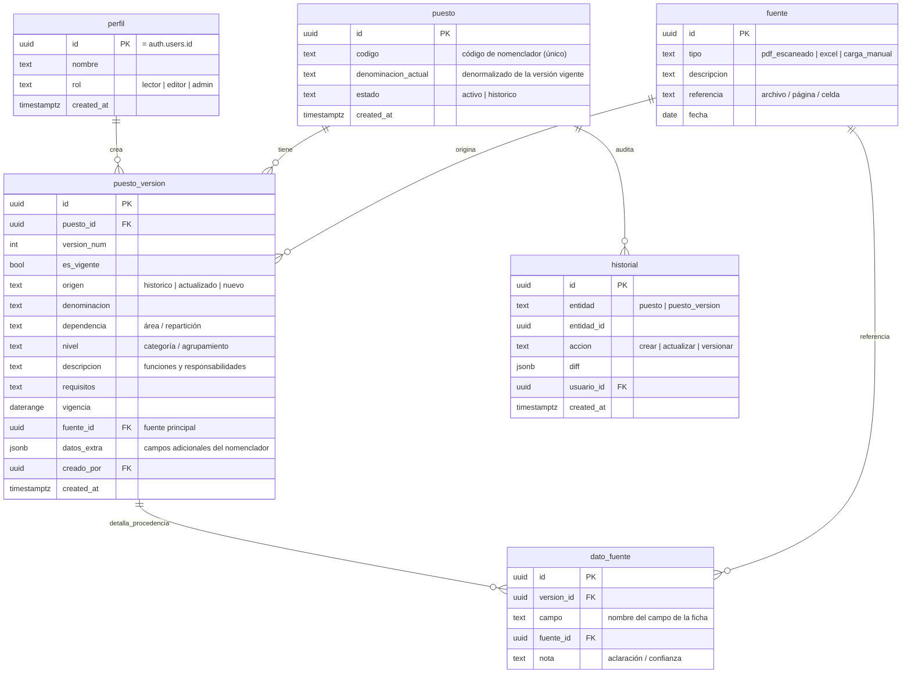

# Arquitectura — Capital humanIA

> Plataforma interna de la Municipalidad de San Miguel de Tucumán para
> digitalizar y administrar el **Nomenclador de Puestos**.
>
> Estado: **fase de configuración inicial**. Este documento define la
> arquitectura objetivo. La implementación de funcionalidades se realiza por
> etapas (ver [`roadmap.md`](./roadmap.md)).

---

## 1. Alcance del MVP

El MVP administra **únicamente puestos**. Explícitamente **fuera de alcance**:
empleados, legajos, salarios, licencias, evaluaciones de personas y decisiones
de contratación.

Capacidades objetivo del MVP:

1. Preservar las **fichas históricas** (fuente: dos PDF escaneados).
2. Crear **versiones actualizadas** de un puesto.
3. Crear **nuevos puestos**.
4. **Consultar y filtrar** puestos.
5. **Registrar la fuente** de cada dato (trazabilidad / procedencia).
6. Conservar **historial de modificaciones**.
7. **Comparar** puestos.
8. **Detectar puestos similares**.
9. **Consultar en lenguaje natural** (etapa posterior).

> El Excel existente es solo un ejemplo de estructura posible; **no** es la base
> de datos definitiva. La fuente documental inicial son los PDF escaneados.

---

## 2. Stack tecnológico

| Capa | Tecnología |
|------|-----------|
| Framework | **Next.js 16** (App Router) + **React 19** |
| Lenguaje | **TypeScript** en modo estricto |
| Estilos | **Tailwind CSS v4** (configuración vía CSS `@theme`) |
| Componentes UI | **shadcn/ui** (estilo `base-nova`) + **Lucide Icons** |
| Base de datos | **PostgreSQL** gestionado por **Supabase** |
| Autenticación | **Supabase Auth** (`@supabase/ssr`) |
| Validación | **Zod** |
| Formularios | **React Hook Form** + `@hookform/resolvers` |
| Tablas | **TanStack Table** |
| Despliegue | **Vercel** |

Versiones fijadas en [`package.json`](../package.json).

---

## 3. Arquitectura de carpetas

Organización **feature-first**: el dominio (`puestos`) concentra su
data-access, componentes, acciones y validadores; la UI genérica y la
infraestructura viven en carpetas transversales.

```
Capital-IA/
├─ docs/                        # Documentación del proyecto
│  ├─ architecture.md
│  └─ roadmap.md
├─ public/
│  └─ brand/                    # Logo y recursos institucionales (ver README)
├─ supabase/
│  └─ migrations/               # Migraciones SQL versionadas del esquema
├─ src/
│  ├─ app/                      # App Router (rutas, layouts, server components)
│  │  ├─ layout.tsx             # Layout raíz (idioma es, metadata, tipografía)
│  │  ├─ page.tsx               # Portada institucional (placeholder actual)
│  │  ├─ globals.css            # Tailwind v4 + tokens de la paleta municipal
│  │  ├─ (auth)/                # Grupo de rutas públicas (login) — etapa Auth
│  │  └─ (app)/                 # Grupo protegido (dashboard del nomenclador)
│  │     └─ puestos/            # Listado, detalle, comparación — por etapa
│  ├─ components/
│  │  ├─ ui/                    # Primitivos shadcn/ui (generados)
│  │  └─ layout/                # Shell institucional: header, sidebar, etc.
│  ├─ features/
│  │  └─ puestos/               # Dominio "puestos" (data-access, acciones, UI)
│  ├─ lib/
│  │  ├─ supabase/              # Clientes browser/server + middleware de sesión
│  │  ├─ validators/            # Esquemas Zod compartidos
│  │  ├─ types/                 # Tipos compartidos y database.types.ts (Supabase)
│  │  └─ utils.ts               # Utilidades (cn, etc.)
│  └─ hooks/                    # Hooks de cliente reutilizables
├─ .env.example                 # Plantilla de variables (sin secretos)
├─ components.json              # Configuración de shadcn/ui
└─ package.json
```

**Criterios de escalabilidad**
- Un dominio nuevo (p. ej. futuros módulos) se agrega como `features/<dominio>`
  sin tocar los demás.
- `features/puestos/` se subdivide en `data/` (acceso a datos server-side),
  `actions/` (Server Actions con validación Zod), `components/` (UI del dominio)
  y `schemas/` (Zod del dominio).
- La UI genérica (`components/ui`) nunca depende del dominio; el dominio sí puede
  consumir la UI genérica.

---

## 4. Server Components vs Client Components

Estrategia: **Server Components por defecto**; se marca `"use client"` solo
donde hay interactividad, estado o APIs del navegador. Las mutaciones se hacen
con **Server Actions** validadas con Zod.

| Elemento | Tipo | Motivo |
|---------|------|--------|
| Layouts (`app/**/layout.tsx`) | **Server** | Estructura estática, sin estado. |
| Páginas de listado / detalle / comparación | **Server** | Traen datos con el cliente Supabase server-side; sin JS al cliente. |
| Data-access (`features/puestos/data`) | **Server** | Consultas ejecutadas en el servidor con la sesión del usuario. |
| Server Actions (crear puesto / versión) | **Server** | Mutaciones seguras; nunca exponen claves al cliente. |
| Shell: header / sidebar estáticos | **Server** | Presentacionales. |
| Formularios (React Hook Form) | **Client** | Estado de formulario, validación en vivo. |
| Tabla de puestos (TanStack Table) | **Client** | Ordenamiento, filtrado y paginación interactivos. |
| Buscador / filtros / combobox | **Client** | Entrada del usuario y actualización de URL. |
| Diálogos, toasts, menús, tabs | **Client** | Interacción y estado local. |
| Consulta en lenguaje natural (UI) | **Client** | Input conversacional + streaming de respuesta. |

**Regla práctica:** el componente cliente más pequeño posible. Las páginas
traen datos en el servidor y pasan `props` serializables a “islas” cliente
(tabla, formulario). Se evita convertir páginas enteras en `"use client"`.

---

## 5. Autenticación y autorización

### Autenticación (Supabase Auth)
- Se usa **`@supabase/ssr`** con tres puntos de integración:
  - `lib/supabase/client.ts` → `createBrowserClient` (Client Components).
  - `lib/supabase/server.ts` → `createServerClient` con manejo de cookies
    (Server Components, Route Handlers, Server Actions).
  - `proxy.ts` (raíz `src/`) → refresco de sesión en cada request y protección
    del grupo `(app)`. En Next.js 16 la convención `middleware` se renombró a
    `proxy`; la lógica reutilizable vive en `lib/supabase/middleware.ts`.
- Al ser una herramienta **interna municipal**, el registro es cerrado: las
  altas de usuarios las realiza un administrador (no hay auto-registro público).
  Método inicial sugerido: **email + contraseña** provistos por el área de
  sistemas (evaluable: enlace mágico / SSO institucional a futuro).

### Autorización (roles + RLS)
Modelo de roles mínimo para el MVP:

| Rol | Permisos |
|-----|----------|
| `lector` | Consultar, filtrar, comparar, ver historial. |
| `editor` | Todo lo del lector + crear puestos y nuevas versiones. |
| `admin` | Todo lo del editor + gestión de usuarios y fuentes. |

- El rol se almacena en una tabla `perfil` vinculada a `auth.users`.
- La autorización se aplica en **dos capas**:
  1. **Row Level Security (RLS)** en PostgreSQL como fuente de verdad (nadie
     escribe sin el rol adecuado, incluso saltando la UI).
  2. **UI / Server Actions**: se ocultan/activan acciones según el rol y se
     re-valida en el servidor antes de mutar.
- La **`SUPABASE_SERVICE_ROLE_KEY`** se usa **solo** en el servidor (ingesta de
  PDFs, tareas administrativas). Nunca se expone al navegador.

---

## 6. Modelo de datos inicial (propuesta)

Principio de diseño: separar la **identidad** del puesto de sus **versiones**.
La ficha histórica es la primera versión; las actualizaciones crean versiones
nuevas sin destruir las anteriores (preservación + historial).



**Notas de diseño**
- **Preservar histórico:** las fichas de los PDF entran como `puesto_version`
  con `origen = 'historico'`; nunca se editan in-place.
- **Versiones actualizadas:** una actualización inserta una nueva
  `puesto_version` (`version_num + 1`, `origen = 'actualizado'`) y marca la
  anterior `es_vigente = false`.
- **Fuente de cada dato:** dos niveles de granularidad.
  - Grueso: `puesto_version.fuente_id` (fuente principal de la ficha).
  - Fino: `dato_fuente` (procedencia campo por campo) para trazabilidad total.
    Puede posponerse; el MVP puede arrancar con `fuente_id` + `datos_extra`.
- **Historial de modificaciones:** tabla `historial` (append-only) alimentada
  por triggers o desde las Server Actions, guardando el `diff` en JSONB.
- **Detección de similares (MVP):** similitud textual con la extensión
  **`pg_trgm`** sobre `denominacion` / `descripcion` (índice GIN + umbral de
  similitud). No requiere IA.
- **Comparación de puestos:** operación de lectura que trae dos (o más)
  `puesto_version` y las contrasta campo a campo en la UI; no necesita esquema
  adicional.
- **Consulta en lenguaje natural (posterior):** se evalúa **`pgvector`** con
  embeddings de las fichas para búsqueda semántica y para alimentar la respuesta
  del modelo. Se define en su propia etapa del roadmap.

> Este modelo fue el **diseño conceptual inicial**. El esquema definitivo
> implementado (18+ tablas, RLS, triggers, código interno) está documentado y es
> autoritativo en [`database.md`](./database.md). Se refinará al analizar el
> contenido real de los PDF durante la ingesta.

---

## 7. Convenciones transversales

- **Validación:** todo input (formularios, Server Actions, params de búsqueda)
  se valida con **Zod**. Los esquemas viven en `features/puestos/schemas` o
  `lib/validators` y se comparten entre cliente (RHF) y servidor.
- **Formularios:** **React Hook Form** + `zodResolver`. Un único esquema Zod por
  formulario como fuente de verdad de tipos y validación.
- **Tablas:** **TanStack Table** (headless) con los primitivos de shadcn/ui para
  el render. Ordenamiento/filtrado/paginación del lado del cliente para el MVP;
  se migra a server-side si el volumen lo requiere.
- **Tipos de base de datos:** se generan con la CLI de Supabase en
  `lib/types/database.types.ts` para tipar las consultas.
- **Accesibilidad:** componentes shadcn/ui (accesibles por defecto), foco
  visible (ring en celeste `#2FAEF2`), etiquetas asociadas, contraste conforme a
  la paleta institucional, `lang="es"`.

---

## 8. Identidad visual

Tokens definidos en [`src/app/globals.css`](../src/app/globals.css) y expuestos
como utilidades Tailwind (`bg-primary`, `text-brand-celeste`, etc.):

| Token | Valor | Uso |
|-------|-------|-----|
| `--primary` / azul | `#0868F2` | Acción principal, énfasis. |
| `--brand-celeste` | `#2FAEF2` | Acentos, foco, íconos. |
| `--brand-amarillo` | `#F5D600` | Detalle de acento (uso puntual). |
| `--background` | `#F7F9FC` | Fondo general. |
| `--foreground` | `#172033` | Texto. |
| `--border` | `#DCE4EE` | Bordes / divisores. |

El logo municipal se ubica en `public/brand/` (ver su `README.md`). La portada
usa un placeholder tipográfico hasta que el archivo esté disponible.

---

## 9. Despliegue

- **Vercel** para la app Next.js. Variables de entorno cargadas en el panel de
  Vercel (no en el repo).
- **Supabase** como backend gestionado (PostgreSQL + Auth + Storage para los
  PDF). Migraciones versionadas en `supabase/migrations/`.
- Entornos sugeridos: `Preview` (ramas) y `Production` (rama principal), cada uno
  con su proyecto/instancia de Supabase o esquemas separados.

---

## 10. Decisiones abiertas (a resolver en próximas etapas)

1. Campos exactos de la ficha del nomenclador → depende del contenido de los PDF.
2. Granularidad de procedencia: `fuente_id` simple vs. `dato_fuente` por campo.
3. Método de autenticación definitivo (contraseña vs. SSO institucional).
4. Estrategia de ingesta de los PDF escaneados (OCR + carga asistida).
5. Motor de la consulta en lenguaje natural y uso de `pgvector`.
```
