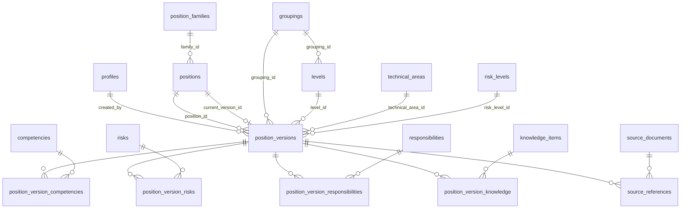

# Base de datos — Capital humanIA

Modelo de datos del **Nomenclador de Puestos** en Supabase (PostgreSQL).
Este documento es la referencia autoritativa del esquema; el diseño conceptual
general está en [`architecture.md`](./architecture.md).

> Estado: esquema implementado y **validado** aplicando las migraciones sobre un
> PostgreSQL real. Alcance del MVP: **solo puestos** (sin personas ni legajos).

---

## 1. Principios de diseño

1. **Identidad vs. versión.** `positions` es la identidad estable del puesto;
   `position_versions` guarda cada estado en el tiempo. Preservar histórico =
   nunca editar destructivamente: cada cambio relevante crea una versión nueva.
2. **Catálogos normalizados.** Competencias, riesgos, conocimientos y
   responsabilidades son catálogos; se vinculan a cada versión por tablas puente,
   con `notes` para observaciones puntuales y `additional_notes` en la versión
   para información excepcional.
3. **Procedencia.** Cada versión puede referenciar su fuente documental (PDF),
   con página impresa/PDF, evidencia textual y estado de verificación.
4. **Sin borrado físico de puestos.** Solo archivado lógico (`status='archived'`
   + `archived_at`); un trigger bloquea `DELETE` sobre `positions`.
5. **Todo cerrado por RLS.** Ninguna tabla del nomenclador es pública; solo un
   `admin` autenticado accede.

---

## 2. Tablas

### Núcleo
| Tabla | Propósito |
|-------|-----------|
| `profiles` | Perfil por usuario de Auth. MVP: rol único `admin`. |
| `positions` | Identidad estable del puesto (`internal_code`, estado, familia). |
| `position_versions` | Versión de un puesto (todos los campos de la ficha). |
| `position_families` | Agrupación opcional de puestos afines / variantes. |
| `audit_logs` | Historial de modificaciones (insert/update/delete). |

### Catálogos
| Tabla | Propósito |
|-------|-----------|
| `groupings` | Agrupamientos (SG, MP, ADM, TEC, PRO). `code` = prefijo del código interno. |
| `levels` | Niveles por agrupamiento (I…VI). Ampliable desde la app. |
| `technical_areas` | Áreas técnicas (para el agrupamiento Técnico). Ampliable. |
| `risk_levels` | Niveles de riesgo (Bajo…Crítico). |
| `competencies` | Catálogo de competencias. |
| `risks` | Catálogo de riesgos. |
| `knowledge_items` | Catálogo de conocimientos ("otros conocimientos"). |
| `responsibilities` | Catálogo de responsabilidades. |
| `source_documents` | Documentos fuente (los dos PDF históricos). |

### Puente (versión ↔ catálogo)
`position_version_competencies`, `position_version_risks`,
`position_version_responsibilities`, `position_version_knowledge`.
Cada una: FK a la versión (cascade) + FK al catálogo (restrict) +
`notes` + `sort_order`, con unicidad `(version, item)`.

### Fuentes
`source_references`: `document_part`, `printed_page_number`, `pdf_page_number`,
`notes`, `verification_status`, `evidence_text`, `verified_by`, `verified_at`.

### Interno
`code_sequences`: contadores por prefijo para el código interno (sin acceso
directo; solo vía funciones).

---

## 3. Diagrama de relaciones



---

## 4. Estados y ciclo de vida

Enum `position_status` (usado por `positions.status` y
`position_versions.validity_status`):

| Estado | Significado |
|--------|-------------|
| `draft` | Borrador; aún no vigente. Única situación en la que una versión puede borrarse. |
| `current` | Vigente. Máximo **una** versión `current` por puesto (índice único parcial). |
| `historical` | Versión superada, preservada. |
| `archived` | Archivado lógicamente (no se borra físicamente). |

Enum `verification_status` (para `source_references`): `pending`, `verified`,
`needs_review`.

Enum `user_role`: `admin` (único en el MVP; ampliable con `ALTER TYPE`).

---

## 5. Código interno (`internal_code`)

Los puestos no tienen código oficial. Se genera uno **interno, único y estable**
que **no cambia** aunque cambie el nombre. Formato `<PREFIJO>-NNNN`:

- Prefijo = `grouping.code` + `-` + (`technical_area.code` si aplica, si no `level.code`).
- `NNNN` = secuencia por prefijo, 4 dígitos (tabla `code_sequences`).

Ejemplos validados: `SG-I-0001`, `MP-II-0001`, `ADM-IV-0001`, `TEC-CON-0001`,
`PRO-III-0001`.

Funciones:
- `build_code_prefix(grouping_id, level_id, technical_area_id) → text`
- `next_internal_code(prefix) → text` (atómica)
- `generate_internal_code(grouping_id, level_id, technical_area_id) → text`

Flujo de alta (desde el servidor): `generate_internal_code(...)` → insertar
`positions` con ese código → insertar `position_versions` v1 → actualizar
`positions.current_version_id`.

---

## 6. Automatización (triggers y funciones)

| Mecanismo | Efecto |
|-----------|--------|
| `set_updated_at()` | Actualiza `updated_at` en cada UPDATE (tablas con esa columna). |
| `prevent_delete()` | Bloquea `DELETE` sobre `positions` (archivado lógico). |
| `prevent_delete_nondraft_version()` | Permite borrar versiones solo en `draft`. |
| `record_audit()` | Inserta en `audit_logs` en insert/update/delete de `positions` y `position_versions`. |
| `handle_new_user()` | Crea `profiles` (rol `admin`) al alta de un usuario en `auth.users`. |
| `is_admin()` | `SECURITY DEFINER`: base de todas las políticas RLS. |

---

## 7. Row Level Security

- RLS **habilitado en todas** las tablas.
- `is_admin()` = existe `profiles` con `id = auth.uid()`, `role='admin'`,
  `is_active`. Es `SECURITY DEFINER` (evita recursión de RLS sobre `profiles`).
- Política general: `for all to authenticated using/​with check (is_admin())`.
- `profiles`: cada usuario ve su propia fila o, si es admin, todas.
- `audit_logs`: **solo lectura** para admin (lo escribe el trigger `SECURITY
  DEFINER`).
- `code_sequences`: RLS habilitado **sin políticas** → sin acceso directo
  (solo vía funciones).
- Defensa en profundidad: las mutaciones sensibles se validan además en el
  servidor (Server Actions), nunca solo en el cliente.

---

## 8. Índices y constraints (resumen)

- Únicos: `positions.internal_code`; `code` de cada catálogo; `levels(grouping_id, code)`;
  `position_versions(position_id, version_number)`; puente `(version, item)`.
- Único parcial: una sola versión `current` por puesto.
- Índices de consulta: `positions(status, family_id, current_version_id)`;
  `position_versions(position_id, grouping_id, level_id, technical_area_id, validity_status)`;
  índice **GIN trigram** en `position_versions.name` (para similitud futura);
  FKs de puente y `source_references`; `audit_logs(table_name, record_id)`.
- Checks: `version_number > 0`; páginas `>= 1`; `valid_until >= valid_from`.
- FKs a catálogos `on delete restrict` (no se borra un catálogo en uso).

---

## 9. Migraciones y seed

Migraciones versionadas en `supabase/migrations/` (orden de aplicación):

1. `..._init.sql` — extensiones, enums, helpers, código interno.
2. `..._catalogs.sql` — perfiles y catálogos.
3. `..._positions.sql` — puestos, versiones, puentes, fuentes, auditoría, funciones.
4. `..._rls.sql` — RLS y políticas.
5. `..._reference_data.sql` — datos de referencia (5 agrupamientos, niveles,
   áreas técnicas iniciales, niveles de riesgo, catálogos starter, documentos fuente).

`supabase/seed.sql` (solo desarrollo, `supabase db reset`) crea **3 puestos DEMO**
marcados con `is_demo = true` y prefijo `[DEMO]`. En producción el sistema puede
funcionar vacío.

### Aplicar el esquema

```bash
# 1) Vincular el proyecto (una vez)
supabase login
supabase link --project-ref <REF_DEL_PROYECTO>

# 2) Aplicar migraciones al proyecto remoto
supabase db push            # o: npm run db:push

# (Opcional, desarrollo local con Docker)
supabase start && supabase db reset   # aplica migraciones + seed
```

### Generar tipos TypeScript

```bash
# Contra el proyecto remoto (no requiere Docker):
supabase gen types typescript --project-id <REF> --schema public \
  > src/lib/types/database.types.ts
# equivalente: SUPABASE_PROJECT_ID=<REF> npm run db:types

# Contra el stack local (requiere Docker):  npm run db:types:local
```

> El esquema de este repositorio se validó aplicando las cinco migraciones y el
> seed sobre un PostgreSQL real: se verificaron la generación de códigos
> (`SG-I-0001`, `ADM-III-0001`, `TEC-INF-0001`), los catálogos (5 agrupamientos,
> 15 niveles, 4 áreas, 4 niveles de riesgo), los `audit_logs` automáticos y el
> bloqueo de borrado físico de `positions`.

---

## 10. Decisiones y notas

- **`risk_level` normalizado.** El campo "nivel de riesgo" de la ficha se modela
  como `risk_level_id` → `risk_levels` (catálogo), no como texto libre.
- **`instrucción` / `título`.** Se mapean a `minimum_education` y `required_title`.
- **`otros conocimientos`.** Catálogo `knowledge_items` + puente; los campos
  educativos van directo en la versión.
- **Familias.** `position_families` queda disponible para variantes; opcional.
- **Áreas técnicas iniciales** (`CON`, `ELE`, `MEC`, `INF`) y **catálogos starter**
  son un punto de partida mínimo; se curan durante la ingesta de los PDF (Etapa 3).
- **Auditoría.** Hoy cubre `positions` y `position_versions`; puede extenderse a
  las tablas puente si se requiere trazabilidad más fina.
```
